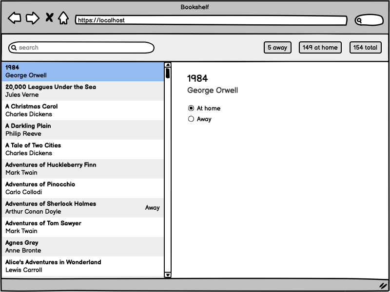
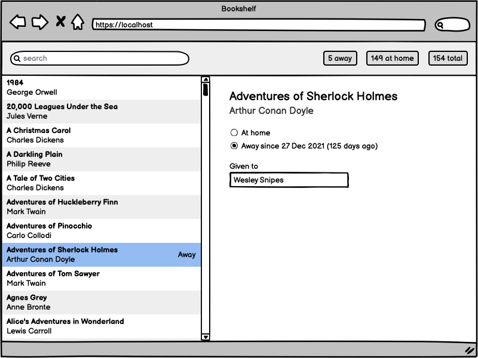
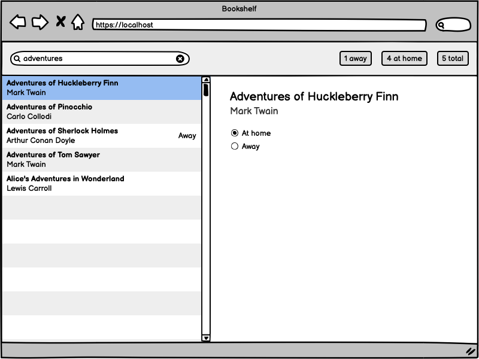

# Bookshelf

An avid book collector is looking for an app to help her keep track of books borrowed by her friends.

## Overview

The app will load the book inventory on start. It would display a summary of how many books were given away, how many are still at home, and the total number of books in the collection.

The user is able to change a book's status ("at home" or "given away") and specify the name of the person to whom it was given. The app will take note of the date when this happened.

## Data format

Book details are stored in an object with `"author"` and `"title"` string properties. The "away" status is stored in a `"given"` property which, when specified, contains the name of the person who took it (`"given.to"`) and the date on which it hapened (`"given.on"`). The date is stored as a string in `YYYY-MM-DD` format.

```js
[
  {
    author: "Joanne Rowling",
    title: "Harry Potter and the Chamber of Secrets",
    given: {
      to: "Daniel Craig",
      on: "2022-01-03",
    },
  },
];
```

## User Interface

A list displays each book's title and author and indicates whether the book is given away. The first row is selected by default. User can navigate up and down the list using arrow keys. Selected row details can be edited in a side pane.



The side pane displays book's title and author, the "at home"/"away" switch, and optionally the name of the person who borrowed the book and the date information. The date information includes the date in user's locale format and the number of days passed since: `"1 Jan 1970 (today | yesterday | N days ago)"`.



A search field helps narrow down the list. Search results will affect the summary information.



## Editing experience

If the book is at home, the radio button is in the "At home" position and no other controls are displayed. Switching to the "Away" state will reveal the "Given to" input field and append date information to the "Away" button label.

When a book is returned, switching the radio button to the "At home" position will clear the relevant record property, hide the input, and remove the date information from the "Away" button label.

## Must have features

- Live search by book's title or author's name.
- Update of summary on search.
- Live status/summary update on edit.

## Optional features

- Quick filter by clicking on "away", "at home", and "total" summary indicators.
- Highlight search term maches in the list.

## Technology choice

Feel free to use any library/framework of your choice including our favourite, [Lightning Web Components](https://lwc.dev/).
